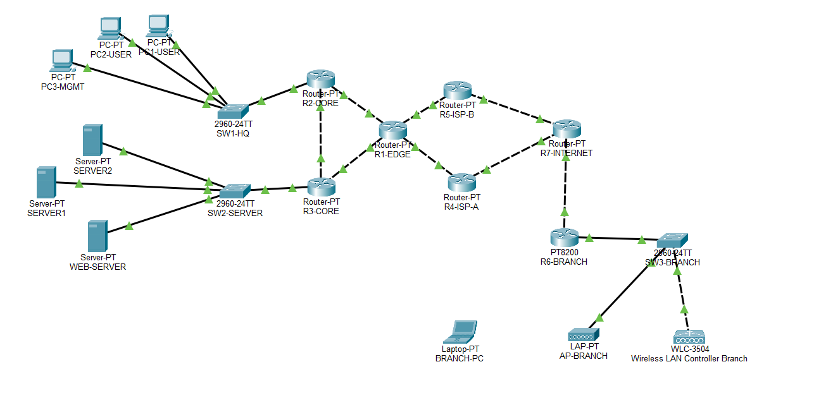

# enterprise-network-security-lab
Enterprise network security lab implementing VLAN segmentation, OSPF, BGP, Layer 2 security controls, ACLs, WLC and redundancy using Cisco Packet Tracer

## Architecture

## Technologies

- Cisco Packet Tracer
- VLANs & Inter-VLAN Routing
- OSPF
- eBGP
- DHCP & DNS
- Cisco WLC / CAPWAP
- SSH
- Extended & Standard ACLs

## Network Security Controls

- Port Security with Sticky MAC
- DHCP Snooping
- Dynamic ARP Inspection (DAI)
- BPDU Guard
- PortFast
- Broadcast Storm Control
- OSPF MD5 Authentication
- SSH-only Device Management
- Management VLAN & VTY ACL
- Inter-VLAN Traffic Restrictions

## Routing & Resilience

- OSPF-based internal routing
- eBGP-based external routing
- Redundant BGP paths through R4 and R5
- Internet connectivity through R7
- Primary/backup path failover planned for validation

## Current Status

### Completed

- Enterprise network architecture
- VLAN segmentation
- Inter-VLAN routing
- OSPF
- eBGP
- DHCP/DNS
- WLC and wireless branch connectivity
- SSH-based management
- Layer 2 security hardening
- OSPF authentication
- Inter-VLAN access controls
- Redundant BGP topology

### In Progress

- BGP route filtering
- BGP path preference and failover
- Edge/perimeter hardening
- Infrastructure hardening
- Monitoring and logging
- Security attack simulation
- Final security assessment

## Lab File

The complete Cisco Packet Tracer topology is available in:

`enterprize_project.pkt`

## Objective

To design, secure, and validate an enterprise network against common
network-layer and Layer 2 security threats while demonstrating secure
routing, segmentation, management-plane protection, and network resilience.
